<div align="center">
  
  
  <br/><br/>
  <picture>
    <source media="(prefers-color-scheme: dark)" srcset="https://readme-typing-svg.demolab.com?font=Orbitron&weight=600&size=18&duration=2600&pause=1100&color=FFFFFF&center=true&vCenter=true&width=760&height=40&lines=B.E+CSE+%2F%2F+Cybersecurity+Specialist;Ethical+Hacker+%2F%2F+AI%2FML+Enthusiast;Advanced+Python+%2F%2F+Backend+Dev;If+it%27s+connected%2C+it%27s+vulnerable.;BTW...+I+use+Arch.;The+quieter+you+become%2C+the+more+you+are+able+to+hear.;Root+is+not+a+privilege.+It%27s+a+responsibility.;I+don%27t+hack+systems.+I+understand+them.;pacman+-Syu+%26%26+conquer+the+world;Security+is+a+process%2C+not+a+product." />
    <source media="(prefers-color-scheme: light)" srcset="https://readme-typing-svg.demolab.com?font=Orbitron&weight=600&size=18&duration=2600&pause=1100&color=000000&center=true&vCenter=true&width=760&height=40&lines=B.E+CSE+%2F%2F+Cybersecurity+Specialist;Ethical+Hacker+%2F%2F+AI%2FML+Enthusiast;Advanced+Python+%2F%2F+Backend+Dev;If+it%27s+connected%2C+it%27s+vulnerable.;BTW...+I+use+Arch.;The+quieter+you+become%2C+the+more+you+are+able+to+hear.;Root+is+not+a+privilege.+It%27s+a+responsibility.;I+don%27t+hack+systems.+I+understand+them.;pacman+-Syu+%26%26+conquer+the+world;Security+is+a+process%2C+not+a+product." />
    
  </picture>
  <br/><br/>
  
</div>

<br/>



<details>
<summary><code>$ cat nithin.py</code></summary>

```python
class Nithin:
    name       = "Nithin"
    degree     = "B.E CSE — Cybersecurity"
    location   = "India"
    os         = "BlackArch Linux + Hyprland"
    interests  = ["Ethical Hacking", "AI/ML", "Backend Dev", "CTFs"]
    learning   = ["Advanced Python", "Django", "FastAPI", "Malware Analysis"]
    tools      = ["Burp Suite", "Wireshark", "Metasploit", "Ghidra"]
    building   = ["KRYPT", "AGX", "BlackArch Toolbox"]
    motto      = "Break things ethically. Fix them permanently."

    def status(self):
        return "[ACTIVE] — Building. Breaking. Learning."
```

</details>

<br/>



<br/>


<p align="center">
  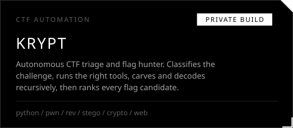
  <a href="https://github.com/nithin2719-commits/blackarch_toolbox">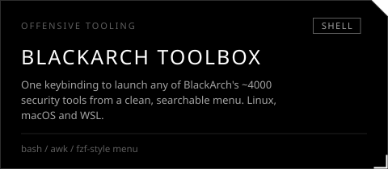</a>
</p>
<p align="center">
  <a href="https://github.com/nithin2719-commits/AGX">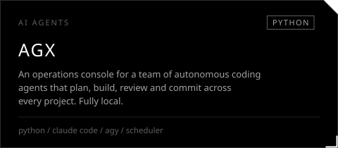</a>
  <a href="https://github.com/nithin2719-commits/HYPRLAND-CONFIGS">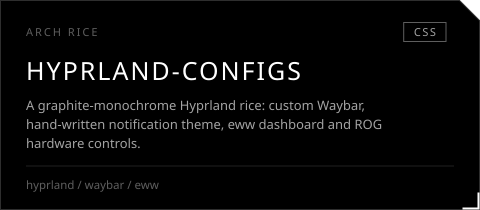</a>
</p>
<p align="center">
  <a href="https://github.com/nithin2719-commits/EvidenceFlow">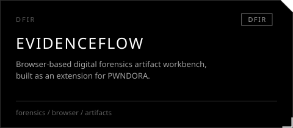</a>
  <a href="https://github.com/nithin2719-commits/Medios">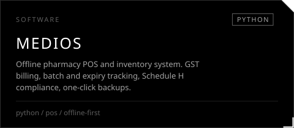</a>
</p>

<br/>

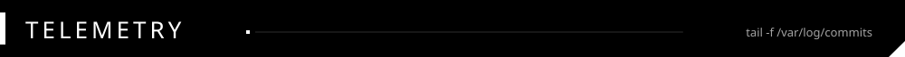


<br/>


<div align="center">

<a href="https://github.com/nithin2719-commits"></a>
<a href="https://www.linkedin.com/in/nithin-g-3a6109401"></a>
<a href="https://instagram.com/nit_2719"></a>

<br/>

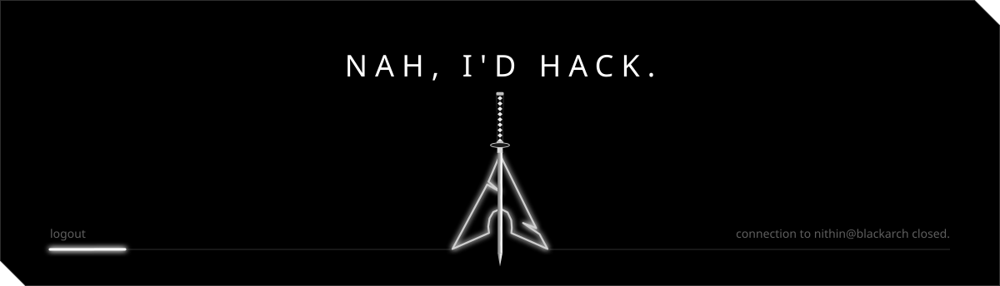

</div>
